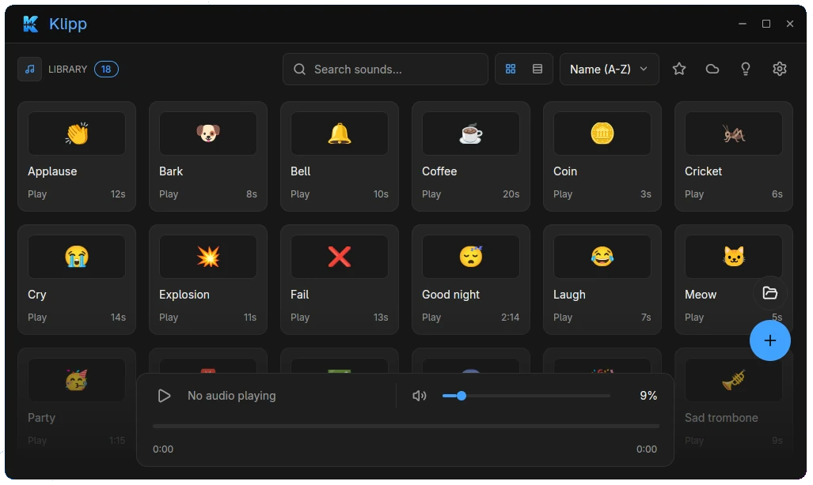

<h1 align="center">Klipp</h1>

<p align="center">
  A desktop soundboard for Linux. Import your own clips, organize them in
  one place, and fire them anywhere through a quick overlay — without
  interrupting what you are doing.
</p>

<p align="center">
  
</p>

## Features

- **Sound library** — grid or compact layout, instant search, sort (A–Z, Z–A,
  recent), favorites filter, per-card durations
- **Player** — play/pause, static waveform with click-and-drag seek,
  volume slider with mute, elapsed/total clock
- **Quick overlay** — floating pie picker on a global shortcut
  (default `Alt+Shift+S`); release to confirm, center button stops
- **Tray icon** — closing the window keeps the app running in the
  background; click the tray icon (or its "Show Klipp" menu) to reopen,
  "Quit" to exit. Disable in Settings → Background to quit on close
- **Browse online** — search myinstants.com, preview, and download straight
  into the library
- **Edit sounds** — custom display name and emoji per clip
- **Virtual microphone** — route clips (plus optional mic pass-through and
  monitoring) through a virtual mic via `pactl`
- **Import your way** — file picker, drag-and-drop, or just drop files in
  the sounds folder (external changes are picked up live)
- **Themes & languages** — dark/light/system theme, English and Português (BR)

## Requirements

- Linux (Wayland-first; X11 supported via the `open-gpui-platform` features)
- Rust stable toolchain
- `pactl` compatible with PulseAudio or PipeWire-Pulse (only needed for the
  virtual microphone; everything else works without it)
- An `xdg-desktop-portal` backend for the global shortcut and file picker
  (production Flatpak provides the app id; see `scripts/dev-run.sh` for dev)

## Run from source

```sh
cargo run
```

`scripts/dev-run.sh` wraps the binary with the portal app-id workaround
needed outside Flatpak. Tests:

```sh
cargo test
```

## Flatpak

App ID: `io.github.ErnestoMuniz.Klipp` (same as the old Electron app, so
`~/.var/app/io.github.ErnestoMuniz.Klipp/` keeps working).

Manifest + metadata live in `packaging/`:

- `io.github.ErnestoMuniz.Klipp.yml` — freedesktop 25.08 + `rust-stable`
  extension, offline build via `cargo-sources.json`
- `io.github.ErnestoMuniz.Klipp.desktop` / `.metainfo.xml` + `icons/`
- `cargo-sources.json` — generated from `Cargo.lock` (commit it; regenerate
  whenever `Cargo.lock` changes)
- `build.sh` — installs SDK, regenerates sources if stale, builds and
  installs `--user`

```sh
# one-time deps (Fedora):
sudo dnf install -y flatpak-builder

# build + install locally:
./packaging/build.sh

# also emit a single-file bundle:
./packaging/build.sh --bundle

# run:
flatpak run io.github.ErnestoMuniz.Klipp
```

Regenerate sources manually after changing dependencies:

```sh
uv run --with tomlkit --with aiohttp python /tmp/flatpak-cargo-generator.py \
  Cargo.lock -o packaging/cargo-sources.json
# (script from https://github.com/flatpak/flatpak-builder-tools/tree/master/cargo)
```

Notes:

- `src/main.rs` + overlay use `app_id = "io.github.ErnestoMuniz.Klipp"` —
  required for Wayland and the GlobalShortcuts portal inside Flatpak.
- `vendor/mouse-coords` is vendored in-tree so the Flatpak source is
  self-contained (no `../../` path dependency).
- Sandbox permissions are minimal: Wayland + fallback X11, PulseAudio,
  DRI, network (myinstants browsing). Sounds/settings stay in the
  sandbox (`~/.var/app/…`) — no extra `--filesystem` needed. `pactl`
  comes from the freedesktop runtime.

## Data

- Sounds: `~/.local/share/klipp/sounds/`
  (`mp3`, `wav`, `ogg`, `flac`, `m4a`, `opus`, `aac`)
- Names/emojis: `~/.local/share/klipp/sound-metadata.json`
- Preferences: `~/.config/klipp/settings.json`

## Tech

Rust + [GPUI](https://github.com/zed-industries/zed/tree/main/crates/gpui)
(`open-gpui`), `symphonia` for decoding, `ashpd` for portals. This is a
rewrite of the original Electron app, kept as reference in `klipp-old`.

## License

GPL-3.0-only, same as the original Klipp.
